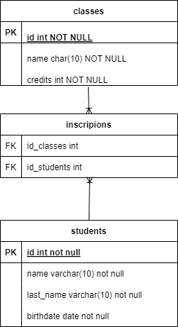
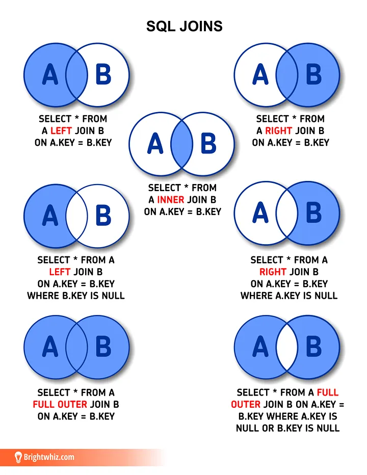

# School Database Project sql

**In this proyect i make a database inspired by a school with information about students, classes, etc.**

**This is a graphical representation:** 




**This are the problems to resolve:**

### [Basic level](./src/level_basic.sql)

- **Problem 1:**
Create a database called "school" and within it a table called "students" with the following fields: id (integer), first_name (string), last_name (string), date_of_birth (date).

-  **Problem 2:**
Insert three records into the "students" table with fictitious data.

- **Problem 3:**
Select all students from the "students" table.

[Solution](./src/level_basic.sql)

### [Intermediate Level](./src/level_medium.sql)

-: **Problem 4:**
Update the record of the student with id 2 to change his last name to "Rodriguez".

- **Problem 5:**
Delete the record of the student with id 3.

- **Problem 6:**
Select only the students born after January 1, 1990.

[Solution](./src/level_medium.sql)

### [Advanced Level](./src/level_hard.sql)

- **Problem 7:**
Create a new table called "classes" with the fields: id (integer), first_name (string), credits (integer). Next, create a table "enrollments" that relates students to classes, with the fields: student_id (integer), class_id (integer).

- **Problem 8:**
Write a query that displays the names of the students along with the names of the classes in which they are enrolled.

- **Problem 9 :**
Calculate the total number of credits that each student is taking.

- **Problem 10 :**
Write a query that lists the students who are not enrolled in any class.


[Solution](./src/level_hard.sql)


## Notas



## Install 
To install do you need to execute this code in the cmd

git clone https://github.com/kevin-pb/sql-tasck-01-school.git

### Docker

The second thing that you need to do is to download Docker Desktop, once download Docker Desktop you need to execute in the cmd the command:

```
docker pull mysql
```

once you execute the command do you need to execute in the file in the file where the Docker compose is the following command:

```
docker-compose up -d 
```


### Worckbench

Now you need to download MySQL Workbench once you download MySQL Workbench you can charge and run the follow files, they are located in the main file (sql-tasck-01-school):

- [level_basic](./src/level_basic.sql)
- [level_medium](./src/level_medium.sql)
- [level_hard](./src/level_hard.sql) 

